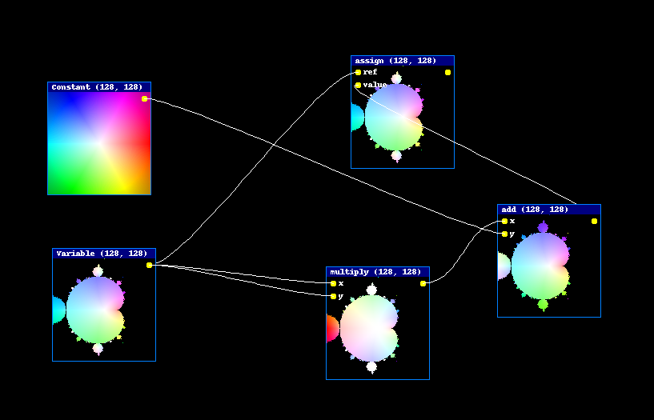

# nodes-for-tensorflow
A visual programming solution using tensorflow and python. This is a very early beta version. Please see the wiki for more information. Suggestions welcome.

Paul

A video example:
](https://www.youtube.com/watch?v=SVxCl9KFUrk "Mandelbrot with tensorflow")